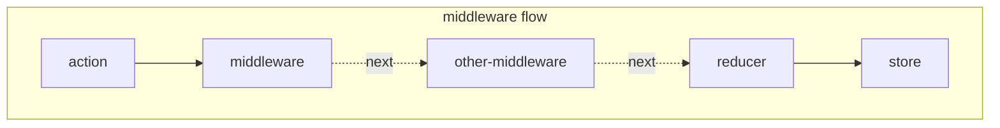

### 설치할 라이브러리

```
$ yarn add redux react-redux
$ yarn add redux-actions
$ yarn add redux-logger
$ yarn add redux-thunk
$ yarn add axios
$ yarn add redux-saga
```

### 접속

```
http://localhost:3000
```

<br>
<br>

#시작
React에서 redux를 사용하고 있고, 비동기 작업을 관리해야 한다면, <br>
middleware를 사용해 손쉽게 관리할 수 있다.

# middleware flow



## middleware 작동 방식

실제 프로젝트를 진행할 떄는 미들웨어를 직접 만들어서 사용할 일은 많이 없다.<br>

<br>

middleware는 ((함수)를 반환하는 함수)를 반환하는 함수 이다. <br>

```javascript
const loggerMiddleware = function _loggerMiddleware(store) {
  return function (next) {
    return function (action) {
      // middleware 기본 구조
    };
  };
};
// const loggerMiddleware = (store) => (next) => (action) => { ... }

// src/lib/loggerMiddleware.js 참고.
```

<hr>

### middleware 적용

middleware는 store를 생성하는 과정 중에 적용시킨다.

```javascript
// index.js
import { createStore, applyMiddleware } from "redux";
import loggerMiddleware from "./lib/loggerMiddleware.";

const store = createStore(rootReducer, applyMiddleware(loggerMiddleware));
```

<hr>

## redux-logger

주로 컴포넌트의 상태를 추적하기 위해 사용한다.<br>

```javascript
import { createLogger } from "redux-logger";

const logger = createLogger();
const store = createStore(rootReducer, applyMiddleware(logger));
```

<hr>

## redux-thunk

비동기 작업을 처리할 떄 가장 많이 사용하는 middleware이다.<br>
객체가 아닌 함수 형태의 action을 dispatch 할 수 있게 해준다.<br>
redux 공식 매뉴얼에서도 redux-thunk를 사용하여 비동기 작업을 다루는 예시를 보여준다.<br>

```javascript
import thunk from "redux-thunk";

const store = createStore(rootReducer, applyMiddleware(logger, thunk));
```

### thunk ?

서브루틴에 추가로 삽입되는 서브루틴으로,<br>
특정 작업을 나중에 할 수 있도록 미루기 위해 함수 형태로 감싼 것이다.<hr>
때문에, thunk는 actoin creator에서 actoin object가 아닌, 함수를 반환해야 한다.

```javascript
/*
 1초 뒤에 increase() or decrease()를 dispatch한다.
 action 내부에서 비동기 작업을 처리하는 것이 아닌, action을 dispatch하는 과정 자체를 비동기 처리함.
*/
export const increaseAsync = () => (dispatch) => {
  setTimeout(() => {
    dispatch(increase());
  }, 1000);
};
```

<hr>

## 웹 요청 비동기 작업 처리하기

thunk의 속성을 활용한 웹 요청 연습을 위해 JSONPlaceholder에서 제공되는 가짜 API 사용<br>
API를 호출할 떄는 주로 Promise 기반 웹 클라이언트인 axios를 사용한다.

```javascript
// 포스트 읽기
export const getPost = (id) => {
  axios.get(`https://jsonplaceholder.typicode.com/posts/${id}`);
};

// 모든 사용자 정보 불러오기
export const getUsers = (id) => {
  axios.get(`https://jsonplaceholder.typicode.com/users`);
};
```

## thunk 작성하기

```javascript
// modules/sample.js

export const getPost = (id) => async (dispatch) => {
  dispatch({ type: GET_POST }); // 요청 시작을 알림
  try {
    const response = await api.getPost(id);
    dispatch({ type: GET_POST_SUCCESS, payload: response.data }); // 요청 성공
  } catch (e) {
    // 요청 실패
    dispatch({ type: GET_POST_FAILURE, payload: e, error: true });
    throw e; // 추후 컴포넌트단에서 에러를 조회할 수 있게 해 줌
  }
};

export const getUsers = () => async (dispatch) => {
  dispatch({ type: GET_USERS });
  try {
    const response = await api.getUsers();
    dispatch({ type: GET_USERS_SUCCESS, payload: response.data });
  } catch (e) {
    dispatch({ type: GET_USERS_FAILURE, payload: e, error: true });
    throw e;
  }
};
```

## thunk refactoring

```javascript
// modules/sample.js

import createRequestThunk from '../lib/createRequestThunk';

export const getPost = createRequestThunk(GET_POST, api.getPost);
export const getUsers = createRequestThunk(GET_USERS, api.getUsers);


// lib/createRequestThunk.js

export default const createRequestThunk = (type, request) => {
  const SUCCESS = `${type}_SUCCESS`;
  const FAILURE = `${type}_FAILURE`;

  return params => async (dispatch) => {
    dispatch({ type: type });
    try {
      const response = await request(params);
      dispatch({ type: SUCCESS, payload: response.data });
    } catch (e) {
      dispatch({ type: FAILURE, payload: e, error: true });
      throw e;
    }
  };
}
```

<hr>

## redux-saga

redux-thunk 다음으로 많이 사용하는 비동기 작업 관련 middleware이다.<br>
아래의 상황처럼 좀 더 까따로운 상황에 사용하는 것이 유리하다.<br>

1. 기존 요청을 취소 처리해야 할 때
2. 특정 액션이 발생했을 때 다른 액션을 발생시키거나, API요청 등 리덕스와 관계없는 코드를 실행할 떄
3. 웹소켓을 사용할 때
4. API 요청 실패 시 재요청해야 할 때

redux-saga는 제너레이터 함수 문법을 기반으로 비동기 작업을 관리해준다.
즉, dispatch하는 action을 모니터링하며 필요한 작업을 따로 수행할 수 있는 middleware이다.
